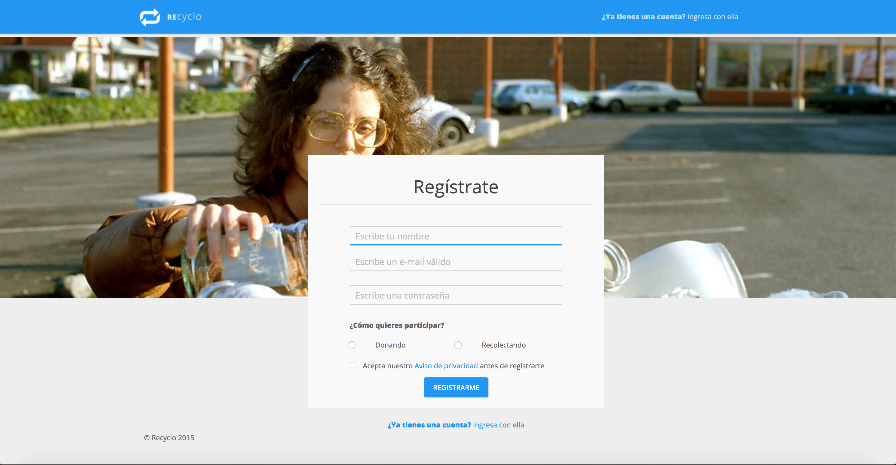
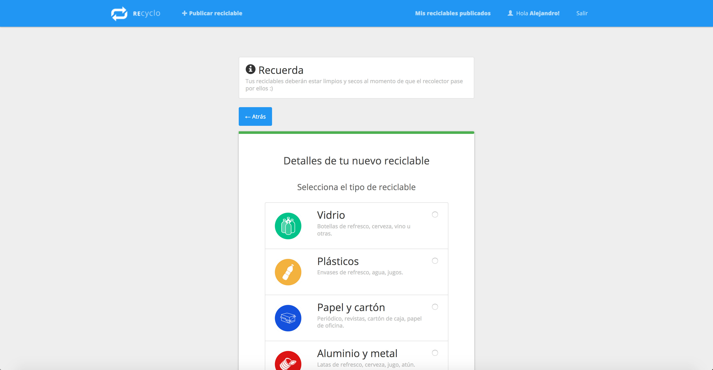

# Recyclo: A web-app for promoting the interchange of recyclable waste

### Introduction

This web-app allows people to create an account and publish recyclable waste for others in the vecinity to pass pick them up and make a profit. 

### Showcase

Some screenshots of this web-app:

#### User registration

#### Publishing a recyclabe resource

#### See the list of recyclable items

### Technical description

This application is a web-based application based on the _Ruby on Rails_ framework on it's version `4.1.9` and the _PostgreSQL_ database. The version of _Ruby_ recommended is _ruby-2.3.0_, _Ruby_ is the programming language on which this web-based visualiser is written.

For deploying this application is enough to just follow the steps below:

1. Install the required gems using `bundle install`. You need to install also ImageMagick because it is used by the `rmagick` gem.
2. Configure your database settings as in any RoR app by going to `database.yml`.
3. Let rails create the specified database by running `rake db:create` and afterwards run the migration with `rake db:migrate` to create the tables needed.
4. You can run `rake db:seed` to start with some data already loaded in. 
5. Go to `views/shared/map` and change the google maps _API_KEY_ value to match yours
6. Run the app with `rails s`
